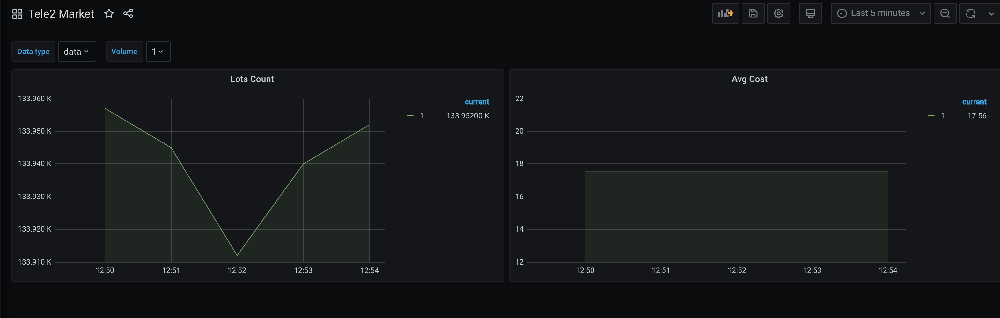

## Tele2 Analytics

### Аналитика количества выставленных лотов на Маркете Теле2.

Для работы необходим установленный Docker.

### Запуск

`docker-compose up`

После запуска необходимо перейти по `http://localhost:3000`
и авторизоваться от имени администратора с паролем, который зашит в 
файле [config](infra/grafana/config.monitoring).

В момент запуска на сервера Tele2 отправляются запросы, полученные результаты помещаются во встроенную базу данных.

Вы можете воспользоваться встроенным дашбоардом или нарисовать свой, используя возможности Grafana.

Пример дашборда:

