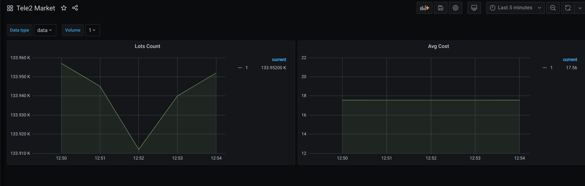

# Tele2 Analytics

Сборщик аналитики по выставленным лотам на Маркете Теле2 с экспортом метрик в
Prometheus и визуализацией в Grafana.

## API

Коллектор опрашивает публичный эндпоинт Теле2:

```
GET https://msk.t2.ru/api/exchange/lots/stats/costs/history?trafficType=data
```

Параметр `trafficType` принимает один из значений: `data`, `sms`, `voice`.

## Структура

```
app/
  Dockerfile
  pyproject.toml
  src/tele2_analytics/
    config.py      # настройки (переменные окружения)
    client.py      # HTTP-клиент к API
    parser.py      # разбор ответа в типизированные данные
    metrics.py     # метрики Prometheus
    collector.py   # цикл сбора
    __main__.py    # точка входа
  tests/           # pytest
infra/
  prometheus/      # конфигурация Prometheus
  grafana/         # provisioning и дашборд Grafana
```

## Запуск (Docker)

Требуется установленный Docker.

```bash
docker compose up --build
```

После запуска:

- Grafana: http://localhost:3000
- Prometheus: http://localhost:9090

Авторизация в Grafana — администратор/пароль из файла
[`infra/grafana/config.monitoring`](infra/grafana/config.monitoring).

## Запуск без Docker

```bash
cd app
python -m venv .venv && source .venv/bin/activate
pip install -e .
tele2-collector
```

Метрики будут доступны по умолчанию на `http://localhost:8080/metrics`.

## Конфигурация

Все параметры задаются переменными окружения:

| Переменная             | По умолчанию                                            |
| ---------------------- | ------------------------------------------------------- |
| `TELE2_API_URL`        | `https://msk.t2.ru/api/exchange/lots/stats/costs/history` |
| `TELE2_TRAFFIC_TYPES`  | `data,sms,voice`                                        |
| `CHECK_INTERVAL`       | `60`                                                    |
| `PROMETHEUS_PORT`      | `8080`                                                  |
| `REQUEST_TIMEOUT`      | `10`                                                    |
| `USER_AGENT`           | современный Chrome UA                                   |

## Тесты и линтер

```bash
cd app
pip install -e '.[dev]'
ruff check src tests
pytest
```

CI (GitHub Actions) запускает lint и тесты на каждый pull request.

## Дашборд

Пример встроенного дашборда:

